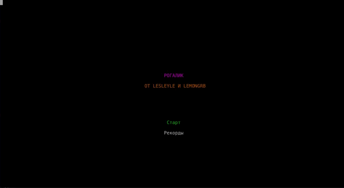
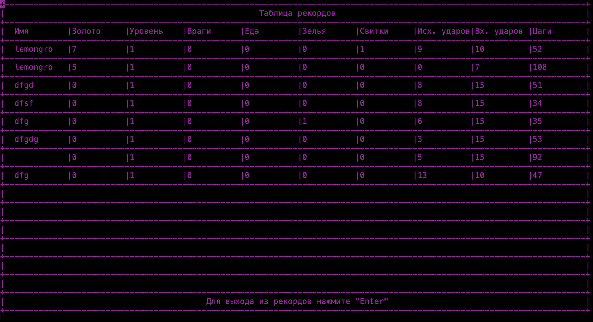

# Rogue (Рогалик)

## Содержание
1. [О проекте](#о-проекте)
2. [Особенности проекта](#особенности-проекта)
	- [Общее](#общее)
	- [Рюкзак и предметы](#рюкзак-и-предметы)
	- [Характеристики, враги и бой](#характеристики-враги-и-бой)
3. [Сборка](#сборка)
4. [Участники проекта](#участники-проекта)

## О проекте

В данном учебном проекте "Школы 21" была реализована консольная игра жанра rogue-like на языке Java. В программе использовались:
* система сборки Gradle (DSL-Kotlin), JDK 21;
* Lanterna (бибилиотека для работы с консольной графикой, визуализация игры);
* Jackson (работа с .json-файлами для загрузки игры и статистики).
	

	
	
	
	*Демонстрация работы игры Rogue*
	

### Список возможностей программы:

#### Общее:

* Игра содержит 21 уровень с подземельями, цель игры - пройти все уровни, переходя между ними с помощью зеленой двери. Обратно на прошлый уровень вернутся возможности нет;
* Каждый уровень может состоять из рандомного количества комнат (от 3 до 9) и соединяющих их коридоров;
* Игра реализована в пошаговом режиме: шаг герой, шаг враги (используется многопоточность);
* В начале уровня на карте рандомно генерируются враги и предметы в зависимости от номера текущего уровня: чем выше уровень, тем меньше предметов, больше золота, сильнее враги;
* В игре присутствует особый режим отрисовки карты "туман войны", который работает в зависимости от месторасположения героя и состояния комнат и коридоров:
	* не исследованные - не отображаются;
	* исследованные комнаты/коридоры, без игрока - отображаются как стены и коридоры;
	* в комнатах с игроком - полное отображение всего наполнения;
	* в коридорах действует алгоритм Ray Casting и Брезенхема - область видимости только в пределах прямой видимости.
 * При выходе из игры происходит сохранение данных в файл "save.json", при повторном запуске игры данные подгружаются обратно;
 * По результатам прохождения игроку показывается таблица с игровой статистикой 13-лучших прохождений игры (сортировка происходит по набранному золоту). Она хранится в файле "dataBase.json".

	

	

	*Поле статистики с 13 лучшими прохождениями*
	

#### Рюкзак и предметы:

* Игрок может подбирать, применять и хранить предметы в рюкзаке, выбрасывать предметы на карту;
* В игре 4 типа предметов: еда, оружие, зелья, свитки. Также можно подобрать золото, которое влияет на итоговую статистику прохождения;
* Еда повышает здоровье игрока, оружие - силу, свитки и зелья - максимальное здоровье, ловкость или силу. Отличие зелий от свитков состоит в том, что они действуют кратковременно (эффект длится 21 шаг героя). Свитки постоянно улучшают характеристики;
* В рюкзаке может хранится до 9 предметов каждого типа.

#### Характеристики, враги и бой:

* Бой происходит в пошаговом режиме, герой атакует врага нажатием клавиши по направлению к нему;
* Враг имеет подобные герою характеристики (сила, ловкость, скорость, здоровье), а также враждебность, которая определяет расстояние, с которого начинается преследование игрока;
* Герой может наносить урон и без оружия благодаря параметру силы;
* Ловкость игрока участвует в расчете вероятности попадания героя по врагу и наоборот, влияет на скорость перемещения по полю;
* Существует 6 видов противников, которые предвигаются по комнате по своему паттерну: 
	* Z - зомби (низкая ловкость, средняя сила и враждебность, высокое здоровье);
	* V - вампир (высокая ловкость, враждебность и здоровье, средняя сила, отнимает при успешной атаке случайное количиство максимального здоровья игроку при успешной атаке, первый удар по нему - всегда промах);
	* G - привидение (высокая ловкость, низкая сила, враждебность и здоровье, каждые 10 шагов становится невидимым, при атаке всегда видимый);
	* O - огр (ходит по комнате на 2 клетки, очень высокая сила и здоровье, после каждой атаки отдыхает один ход, потом контратакует, низка ловкость, средняя враждебность);
	* S - змей-маг (очень высокая ловкость, ходит по диагоналям, меняя сторону, у каждой успешной атаки есть вероятность "усыпить" игрока на ход, высокая враждебность);
	* M - мимик (враг, который имитириует предметы в спокойном состоянии, в зоне агрессии начинает атаковать и превращается в M, высокая ловкость, низкая сила, высокое здоровье, низкая враждебность);
* При победе над врагом персонаж получает некоторое количество золота в зависимости от характеристик врага.

## Особенности проекта

В рамках учебного проекта неоходимо было соответствовать следующим требованиям:

* В игре выделены слои: домена и геймплея (Domain), рендеринга (Presentation) и работы с данными (Data Layer). Использован паттерн MVC для связывания логической и графической части программы с помощью контроллера (Controller);

## Сборка

Сборка программы производится с помощью Gradle (DSL-Kotlin). Ниже представлены команды, которые можно прописать в консоли в корне проекта:

&nbsp;&nbsp;&nbsp;&nbsp;``./gradlew shadowJar`` - создание папки build с .jar проекта;

&nbsp;&nbsp;&nbsp;&nbsp;``java -jar build/libs/rogue-1.0-all.jar`` - запуск игры (Unix-системы);

&nbsp;&nbsp;&nbsp;&nbsp;``javaw -jar build/libs/rogue-1.0-all.jar`` - запуск игры (Windows).

## Участники проекта

| Участник      |            |
| ------------- | ------------------ |
| [lesleyle](https://github.com/IvanVito) | Логика главного героя, врагов, боёвка, сохранение игры и статистики |
| [lemongrb](https://github.com/Shyrasya) | Игровая карта, рюкзак, предметы, туман войны |
