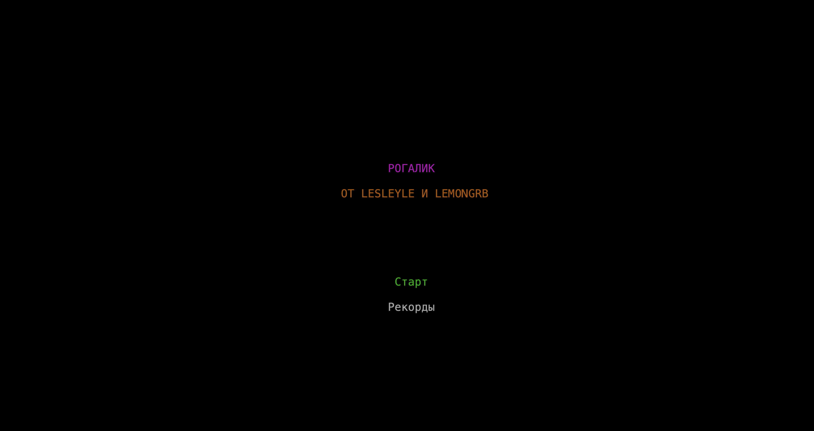
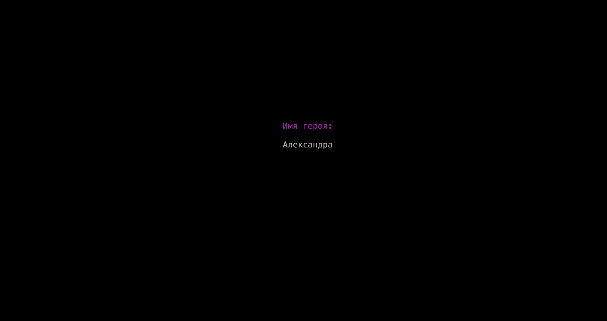
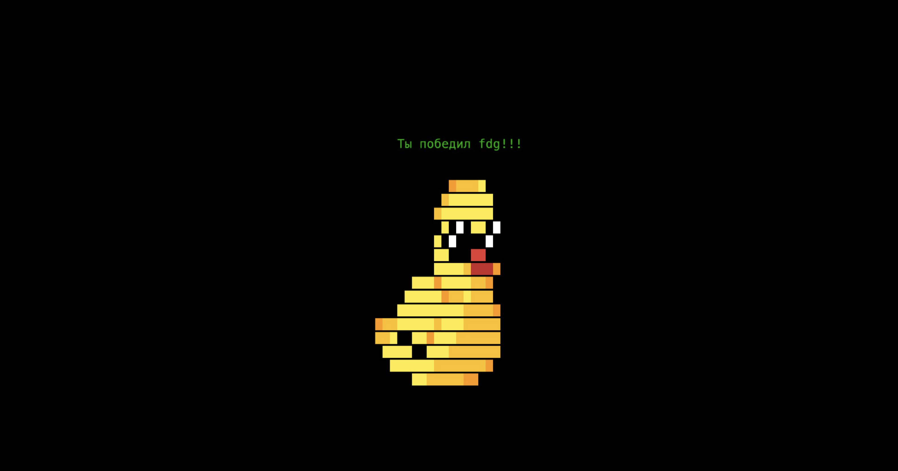

# Rogue (Рогалик)

## Содержание
1. [О проекте](#о-проекте)
2. [Особенности проекта](#особенности-проекта)
	- [Общее](#общее)
	- [Рюкзак и предметы](#рюкзак-и-предметы)
	- [Характеристики, враги и бой](#характеристики-враги-и-бой)
3. [Сборка](#сборка)
4. [Участники проекта](#участники-проекта)

## О проекте

В данном учебном проекте "Школы 21" была реализована консольная игра жанра rogue-like на языке Java. В программе использовались:
* система сборки Gradle (DSL-Kotlin), JDK 21;
* Lanterna (бибилиотека для работы с консольной графикой, визуализация игры);
* Jackson (работа с .json-файлами для загрузки игры и статистики).

	

	

	*Визуальное представление игры Rogue*
	

*Демонстрация работы игры Rogue*

### Список возможностей программы:

#### Общее:
* Игровой процесс начинается с главного меню, в котором можно просмотреть статистику ранее пройденных игр, а также начать новую игру, нажав **Enter**, вписав в следующем поле имя главного героя (ввод возможен до 10 символов, предусмотрено стирание имени при помощи **Backspace**);

	
	 
<em>Стартовое меню игры и ввод имени героя</em>

* Игра содержит 21 уровень с подземельями, цель игры - пройти все уровни, переходя между ними с помощью зеленой двери. Обратно на прошлый уровень вернутся возможности нет;
* Каждый уровень может состоять из рандомного количества комнат (от 3 до 9) с рандомной геометрией и соединяющих их коридоров (от 2 до 12);
* Игра реализована в пошаговом режиме: шаг герой, шаг враги (для них используется многопоточность);
* В начале уровня на карте рандомно генерируются враги и предметы в зависимости от номера текущего уровня: чем выше уровень, тем меньше предметов, больше золота, сильнее враги;
* Герой на уровне случайно появляется в одной из комнат, в которой гарантировано отсутствие врагов;
* По результатам прохождения игроку показывается таблица с игровой статистикой 13-лучших прохождений игры (сортировка происходит по набранному золоту). Она хранится в файле "dataBase.json". Помимо набранного золота в статистике отображается полученный уровень, количество побежденных противников, количество съеденной еды, выпитых зелий, прочитанных свитков, количество нанесенных и пропущенных ударов, количество пройденных клеток;

	

	

	*Поле статистики с 13 лучшими прохождениями*
	

* Выход из программы осуществляется на горячую клавишу **Esc** с возможностью сохранения данных в файле "save.json" и повторной их загрузкой игры при входе в главном меню через поле "Start";
* Управление героем происходит при нажатии клавиш (прописываются на экране для наглядности):
	* "w" - верх,
	* "d" - вправо,
	* "s" - вниз,
	* "a" - влево,
	* "f" - выбросить предмет, 
	* "h" - использование оружия,
	* "j" - использование еды,
	* "k" - использование зелья,
	* "e" - использование свитка;
	* 1-9 выбор номера предмета из списка в рюкзаке;

* В игре присутствует особый режим отрисовки карты "туман войны", который работает в зависимости от месторасположения героя и состояния комнат и коридоров:
	* не исследованные - не отображаются, 
	* исследованные комнаты/коридоры, но без игрока - отображаются как стены и коридоры, 
	* в комнатах с игроком - полное отображение всего наполнения,
	* в коридорах действует алгоритм Ray Casting и Брезенхема - область видимости только в пределах прямой видимости.

#### Рюкзак и предметы:
* Игрок может подбирать, применять и хранить предметы в рюкзаке (он расположен в правой боковой части экрана), выбрасывать предметы на карту;
* В игре всего 4 типа предметов: еда, оружие, зелья, свитки. Также в комнатах можно подобрать золото (выбирается рандомное число до 20 единиц);
* Еда повышает здоровье игрока, оружие - силу, свитки и зелья - максимальное здоровье, ловкость или силу. Отличие зелий от свитков состоит в том, что они действуют кратковременно (эффект длится 21 шаг героя). Свитки постоянно улучшают характеристики;
* При наступании на предмет героем, он автоматически кладется в рюкзак (может хранится до 9 предметов каждого типа);
* При выкидывании предмета на карту он кладется справа от персонажа, также и при смене оружия (отложенное выпадает на пол, выбранное кладется в руку).

#### Характеристики, враги и бой:
* В игре присутствует строка с характристиками героя: его здоровье, максимальное здоровье, сила, ловкость, текущий уровень и количество полученного золота. Строка расположена в нижней части экрана;
* Бой происходит в пошаговом режиме, герой атакует врага нажатием клавиши по направлению к нему, враг может начать бой при контакте с героем;
* Враг имеет подобные герою характеристики (сила, ловкость, скорость, здоровье), а также враждебность, которая определяет расстояние, с которого начинается преследование игрока;
* Герой может наносить урон без оружия благодаря параметру силы, которая также совокупно влияет на наносимый урон врагу при помощи оружия;
* Ловкость игрока участвует в расчете вероятности попадания героя по врагу и наоборот, также влияет на скорость перемещения по полю;
* Всего существует 6 видов противников, которые по своему паттерну предвигаются по комнате: 
	* Z - зомби (низка ловкость, средняя сила и враждебность, высокое здоровье), 
	* V - вампир (высокая ловкость, враждебность и здоровье, средняя сила, отнимает при успешной атаке случайное количиство максимального здоровья игроку при успешной атаке, первый удар по нему - всегда промах), 
	* G - привидение (высокая ловкость, низкая сила, враждебность и здоровье, каждые 10 шагов становится невидимым, при атаке всегда видимый), 
	* O - огр (ходит по комнате на 2 клетки, очень высокая сила и здоровье, после каждой атаки отдыхает один ход, потом контратакует, низка ловкость, средняя враждебность), 
	* S - змей-маг (очень высокая ловкость, ходит по диагоналям, меняя сторону, у каждой успешной атаки есть вероятность "усыпить" игрока на ход, высокая враждебность), 
	* M - мимик (враг, который имитириует предметы в спокойном состоянии, в зоне агрессии начинает атаковать и превращается в M, высокая ловкость, низкая сила, высокое здоровье, низкая враждебность);
* Логика ударов происходит в несколько этапов: проверка на попадание (учитывается ловкость и скорость бьющихся), расчет урона (сила), применение урона (уменьшение здоровья). Если здоровье опустилось до 0, то данный персонаж погибает;
* При победе над врагом персонаж получает некоторое количество золота в зависимости от характеристик врага;
* При смерти персонажа игрок возвращается в главное меню с возможностью повторно ввести имя главного героя и начать игру сначала.

	

	

	*Победный экран, который появляется при прохождении игроком 21 уровня*
	

## Особенности проекта

В рамках учебного проекта неоходимо было соответствовать следующим требованиям:

* В игре выделены слои: домена и геймплея (Domain), рендеринга (Presentation) и работы с данными (Data Layer). Использован паттерн MVC для связывания логической и графической части программы с помощью контроллера (Controller);
* В доменном слое описаны основные игровые сущности (Person, Backpack, Item, Level, Room и т.д.).

## Сборка

Сборка программы производится с помощью Gradle (DSL-Kotlin). Ниже представлены команды, которые можно прописать в консоли в корне проекта:

&nbsp;&nbsp;&nbsp;&nbsp;``./gradlew shadowJar`` - создание папки build с .jar проекта;

&nbsp;&nbsp;&nbsp;&nbsp;``java -jar build/libs/rogue-1.0-all.jar`` - запуск игры (Unix-системы);

&nbsp;&nbsp;&nbsp;&nbsp;``javaw -jar build/libs/rogue-1.0-all.jar`` - запуск игры (Windows).

## Участники проекта

| Участник      |            |
| ------------- | ------------------ |
| [lesleyle](https://github.com/IvanVito) | Логика главного героя, врагов, боёвка, сохранение игры и статистики |
| [lemongrb](https://github.com/Shyrasya) | Игровая карта, рюкзак, предметы, туман войны |
